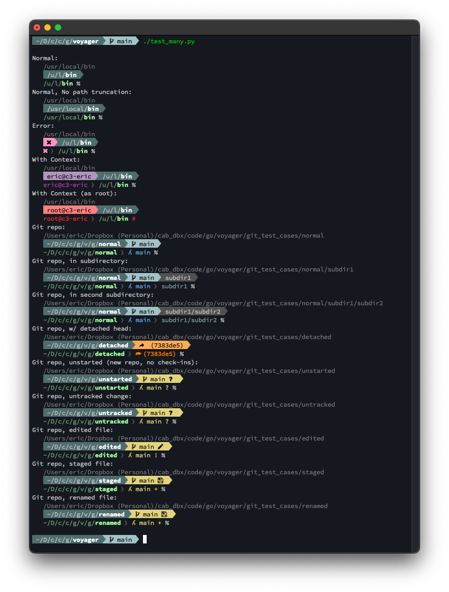
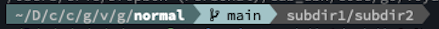

A git-aware prompt for `zsh` and `bash`.

Like [Starship](https://starship.rs) but smaller, and with a single mission.

Voyager recognizes when you are in a git repo directory and shows your git repo name and status in the middle of your path, with the git root path on the left, and your location within that repo (i.e. subdirectory relative to the repo root) on the right. 

## Installation

### Powerline font
By default Voyager uses Powerline font symbols.  To view them you will need to install a Powerline font in your terminal program.

You can find a huge number of Powerline patched fonts [here](https://github.com/powerline/fonts).

Personally I use the Powerline patched version of [SourceCodePro](https://github.com/powerline/fonts/tree/master/SourceCodePro).

_Voyager also supports a "text" format for use in environments where Powerline symbols are unavailable (its also useful when you are capturing terminal output logs)._

### Installing From a Pre-Made Build
- Download one of the pre-made builds from [Releases](https://github.com/epmoyer/voyager/releases).
- Extract the archive
    - For tar archives: `tar -xvzf <archive>` e.g. `tar -xvzf voyager_1.7.0.linux.arm.tgz`
- `cd` into the extracted archive.
- run `./install.sh`
- Exit your shell and open a new one (or just open a new one somewhere else).  The new prompt should be present when you open the new shell.
    - NOTE: I recommend opening a new shell first to test that the new prompt is working.  It's always frustrating to break the prompt in the shell you are trying to do work in.  If the prompt is wonky in the new shell for some reason, then you'll still have a good prompt in your old shell session so that you can fix the issue or uninstall.

#### Installation example
🔴 TBD

### Installing From Source
- Follow the [Build Instructions](#build-instructions) to build the installation images.
- `cd` into the build for your OS and processor architecture under `dist/builds`
- Run `./install.sh`

## Uninstalling
- Delete the shell initialization hook from your `~/.bashrc` and/or `~/.zshrc`.
    - Delete the lines from:
        - `# voyager:start ---------------------------------------------------------`
    - Through:
        - `# voyager:end --------------------------------------------------------`
- Exit your shell (`exit`) and start a new one.
    - Your prompt should now be back to its "pre-voyager" normal.  We needed to do that before deleting the voyager scripts and executable below.
- Delete the shell initialization scripts
    - `rm -r ~/.voyager`
- Delete the executable:
    - `sudo rm /usr/local/bin/voyager`

## Helper aliases
Voyager defines several aliases to help you easily change options on-the-fly (see `dist/resources/bashrc.init.bash` and `dist/resources/zshcr.init.sh`).

- `vger_text`
    - Set the prompt to text mode.
- `vger_pl`
    - Set the prompt to [powerline](#powerline-font) mode.
- `vger_short`
    - All but the last path component will be truncated (to a single character).
    - If you are in a git repo, this only affects the git root-path (i.e. the path up to the git root folder.  Git repo subdirectories are always shown in full).
- `vger_long`
    - All path components will be shown in full.
- `vger_16m`
    - Set the color mode to `16m` (i.e. 24-bit RGB)
- `vger_256`
    - Set the color mode to `256`
- `vger_16`
    - Set the color mode to `16`
- `vger_none`
    - Set the color mode to `none`

## Running the demo
The demo is written in Python. To run it you will need to have Python 3.8 or greater installed, as well as [click](https://click.palletsprojects.com/en/8.1.x/) and [rich](https://rich.readthedocs.io/en/stable/introduction.html).

The demo expects a bunch of small subdirectories to exist under `git_test_cases/` (each one is a small git repo to exercise the prompt under different repo conditions). To create those directories, `cd git_test_cases`, then `tar -xvzf git_test_cases.tgz`.

The demo expects an executable (`voyager`) to be at the git repo root.  You can run `go build .` to create it.

- View the various prompt cases in color mode `16m`:
    - `./demo.py cases`
- View the various prompt cases in all color modes:
    - `./demo.py cases -c`
- View the various prompt output formats in color mode `16m`:
    - `./demo.py formats`
- View the various prompt output formats in all color modes:
    - `./demo.py formats -c`

## About ICS (Intermediate Color Syntax)
🔴 TBD

## Build Instructions
_(These instructions presume that you have a working [go](https://go.dev) environment set up on your machine)_

### Building from source
- Clone the repo.
- `cd` into the repo.
- Run `go get .` to fetch the dependencies.
- Run `./build.sh`
    - The builds will be created in `/dist/builds`
    - the `zip`/`tar` images will be created in `/dist/images`

### Building for other architectures/processors
The build script creates cross-compiled builds for multiple OS's and processor architectures.  If you need to create a build for different OS or architecture, add a new one to the end of the `.build.sh` script.

For example, this line creates a release for the `linux` OS and the `amd64` architecture, and packages the output as a `tar` image:

`do_build linux amd64 tar`

The API of the `do_build()` function is basically `do_build(GOOS, GOARCH, [tar|zip])` so you can pass any `GOOS` or `GOARCH` that `go` [supports](https://go.dev/doc/install/source#environment).

**NOTE**: For clarity, if the `GOOS` is set to `darwin` then the name `macos` gets used when creating build outputs.

## Contributing
🔴 TBD